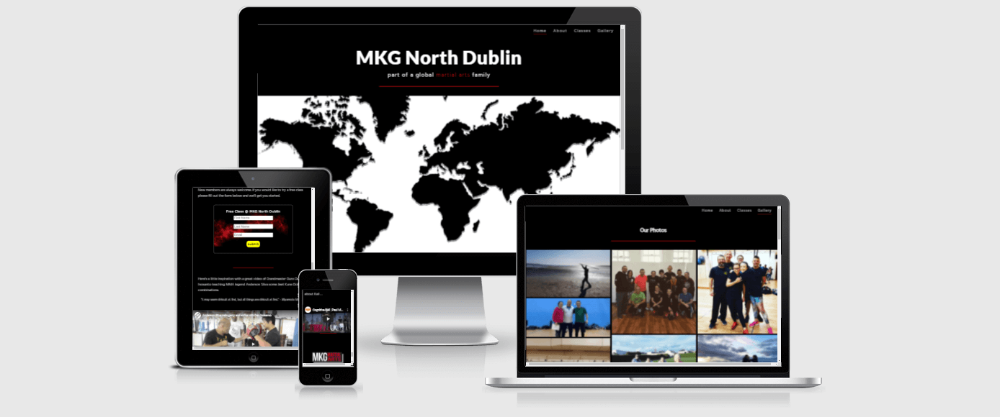
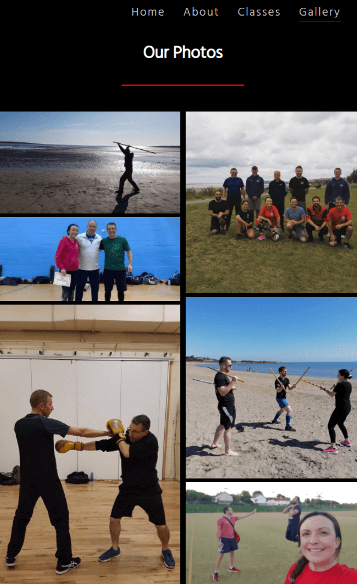

# MKG North Dublin

MKG North Dublin is a martial arts club based in Skerries, Co. Dublin. The MKG North Dublin website is targeted at people who are considering training in martial arts and are looking for information about the club. The website aims to provide all the relevant information about the club and the classes provided and aims to encourage new members to try a class. The theme of the site is welcoming and encouraging to the user.

Welcome to [MKG North Dublin](https://davecaulfield.github.io/mkg-north-dublin-martial-arts/index.html)

# User Experience (UX)

- The user experience (UX) and user interface (UI) was considered from the start. The site aims to give the user an enjoyable experience whilst easily and intuitively navigating the site.

## Wireframes
- The wireframes to layout the design and flow for MKG North Dublin website were produced using Balsamiq. 
- Wireframes were made for mobile and desktop displays. 
- There are some differences between the original wireframes and the deployed site.

[Back to top](#mkg-north-dublin)

## Site Structure
The MKG North Dublin website has four pages. The [home](index.html) page, [about](about.html) page, [classes](classes.html) page and [gallery](gallery.html) page are all accessible from the navigation menu links. There is a [thank you](thankyou.html) page that greets the user after they submit a request for a free class via the free class form.

[Back to top](#mkg-north-dublin)

## Design Choices

### Typography
The fonts used are Lato with a fallback of tahoma for the main heading and hind with a fall back of sans-serif for the section headings and body text.
   *  Lato allows for a less formal and a more welcoming feel to the large bold text used in the main heading on the homepage. 
   *  Hind is used for section heading and gives a less formal, and a more welcoming feel. Hind is also used in the body text and contrasts with the section headings. Its clear and easily readable for the user. 

### Colour scheme

The colour scheme is based on the MKG North Dublin martial arts club colours - black, white, red, yellow.
Black gives a premium feel to the club website. Subtle use of red, white and yellow help to emphasis different sections and features to the user. The body text was changed from white to silver to add more contrast with the section headings and make the text easier to read.

[Back to top](#mkg-north-dublin)

# Features

The MKG North Dublin website is designed to provide clear information and intuitive navigation for the user. The theme is minimlaist but inviting and encouraging for the user.

## Existing Features

### Navigation Menu
   - The navigation menu sits at the top of all pages on the website. It contains interactive links to all pages guiding the user easily throughout the website.

   

[Back to top](#mkg-north-dublin)

### The landing page
   - The landing page displays an image map of the world with a club tag line and quote. This combines to let the the user know that MKG North Dublin is a martial arts club that is part of a wider global martial arts organisation and conveys a welcoming and positive club ethos to the user. The idea and code structure for the zoom effect came from the [Code Institute](https://codeinstitute.net/ie/) Love Running project.

[Back to top](#mkg-north-dublin)

###  Footer
   - The footer contains contact details and links to social media sites making it easy for the user to contact the club.
   - The phone and email details are inter-active allowing the user to click to connect with the club.
   - The social media icons are inter-active and open in a new tab. The club is very active on social media which allows the user to learn more about the club.
   - A scroll to top feature was added using the club logo in the footer. This allows for easier navigation of the site for the user. 

[Back to top](#mkg-north-dublin)

### About us

   - The about us section is the first paragraph on the about page and provides the club message to the user that the club is fun and suitable for all ages and abiities.

### Our Coaches
   - Our Coaches section provides a photo and background information of the coaches. 
   - The coaches smiling in the photo re-assures the user and helps the user connect with the coaches. It conveys a welcoming message of fun to the user.
   - The red, black and white of the instructor photo also connects the websites color scheme. 

   

  [Back to top](#mkg-north-dublin) 

### Our Story 

   - Our Story section provides an image of the club logo and gives a brief history of the club and its links with a global martial arts organisation. This re-assures the user the club has a history, is experienced and is also growing.
   - The red, black and white of the logo provide continuity and flow through the website sections. 

   

  

  [Back to top](#mkg-north-dublin)  

###  Description of arts

   - A description is given of the three main style of martial arts available at the club. This gives the user a clear understanding of what arts the club teaches.

   
   

  [Back to top](#mkg-north-dublin)  
  

### Benefits of Martial Arts
   - A Benefits of Martial Arts section outlines some of the benefits of training martial arts to the user. 
   - The benefits listed are weighted more toward the mental benefits as they may be less well known to the user. It also gives a less intimating feel to the user.
   - An embedded TedX talk explains in a more detailed and engaging way what the Filipino martial art of Kali is and the cognitive benfits of it. 
   - The TedX content and its branding colours match the website and re-inforces the benefits of Kali. It also promotes the art to the user as it not a widely known martial art. 
   - The video does not play automatically and is controlled by the user.

   

  [Back to top](#mkg-north-dublin)  

### Classes page
   - The Classes page lets the user know that classes are suitable for beginners.
   - Location of the club and classes is provided.
   - An interactive timetable lets the user easily find out class times.
   - A description of the different class age groups is provided.
   - A form to request a free class is highlighted and has a call to action button.
   - A video demonstrating some training in Jeet Kune Do with a re-assuring quote helps encourage the user to try out a class.

### Class Timetable 
   - The class timetable provides an interactive drop down feature that allows easy navigation for the user on both mobile and desktop.
   - The code structure for the timetable came from [Codepen](https://codepen.io/markcaron/pen/aWamrz). 

   

   

  [Back to top](#mkg-north-dublin) 

### Free Class Form
   - A free class form encourages the user to try a free class. The form stands out on the page and has a call to action submit button.
   - The form has three input fields - first name, last name, and email. All fields are required to allow the form to be submitted.

   

  [Back to top](#mkg-north-dublin) 

### Jeet Kune Do Video
   - The video content demonstrating some training in Jeet Kune Do and the quote are re-assuring to the user and helps motivate and encourage the user to try out a class. 
   - The video does not play automatically and is controlled by the user.

   

  [Back to top](#mkg-north-dublin) 

### Thank You Page
   - A Thank you page greets the user when they submit the free class form.
   - This is used as there is no post function in the website.
   - The Thank you page explains to the user that their free class is waiting for them but the application form did not go through. It informs the user to email the club to arrange their free class. The thank you messaage is signed by the head coach.
   - The familar navigation menu and footer are in place on the thank you page.
   - The thank you page feature allows the website to be used in its current state by MKG North Dublin Ltd without having to wait for a form post function or back end to be added in a future release.

   

### Gallery

   - A gallery page of photos lets the user see more of the club. The idea and code structure came from the [Code Institute](https://codeinstitute.net/ie/) Love Running project.

   

  [Back to top](#mkg-north-dublin) 

## Future Features
  - A shop section utilizing an e-commerce platform to allow the club to handle orders received for equipment & clothing.
  - A members area to allow students access the clubs online instructional videos.

# Technologies Used

  - [HTML](https://html.spec.whatwg.org/) was used to structure the website.
  - [CSS](https://www.w3.org/Style/CSS/Overview.en.html) was used to style the website.
  - [Balsamiq](https://balsamiq.com/wireframes/) was used to create the wireframe designs.
  - [Gitpod](https://www.gitpod.io/#get-started) was used to create and edit the website files.
  - [Github](https://github.com/) was used to host and deploy the website.

   [Back to top](#mkg-north-dublin) 

# Testing

Please see [testing](testing.md) page for details of MKG North Dublin website testing. 

 [Back to top](#mkg-north-dublin) 

# Deployment

 ## To deploy the site
 - The site was deployed to GitHub pages. The steps to deploy are as follows:

 1. In the Github repository select the **Settings** tab.
 2. Select the **pages** tab on the left of screen.
 3. In the **source** section select the branch drop down and set to **main**, then click **save**.

 

 4. Once you select save the page will refresh and a link to the published site will be displayed.

 

Live link to the published site -
[https://davecaulfield.github.io/mkg-north-dublin-martial-arts/](https://davecaulfield.github.io/mkg-north-dublin-martial-arts/)

## To fork the repository on Github

A fork is a copy of a repository. Forking a repository allows you to freely experiment with changes without affecting the original project.

1. In the Github repository select the **fork** button on the top right of screen. This will create a copy of the original repository to your github account.

## To clone the repository

Cloning the repository creates a local copy on your computer.

1. In the Github repository select the **code** tab.
2. In the **clone https** section select the clipboard icon.

3. Open **Git Bash** terminal in your IDE.
4. Create a directory for the cloned repository.
5. Enter command **git clone** and paste the URL copied from GitHub.
6. Press **enter** and the local clone will be created.

 [Back to top](#mkg-north-dublin) 

 # Credits

 ## Content
 - The wireframes were created using [Balsamiq](https://balsamiq.com/wireframes/)
 - The font came from [GoogleFonts](https://fonts.google.com/)
 - The icons came from [Font Awesome](https://fontawesome.com/)
 - The code structure for the timetable came from [Codepen](https://codepen.io/markcaron/pen/aWamrz)
 - The idea for the landing page zoom and gallery came from [Code Institute - Love Running project](https://codeinstitute.net/ie/)

 ## Media
 - The MKG logos and photos came from [MKG North Dublin](https://www.facebook.com/mkgnorthdublin/)
 - The landing page image came from [Freeimages](https://www.freeimages.com/)
 - The embedded videos came from [YouTube](https://www.youtube.com/)
 - The photos and images were compressed using [Compressor](https://compressor.io/) and [Tinypng](https://tinypng.com/)

 [Back to top](#mkg-north-dublin) 

 # Acknowledgements

 The MKG North Dublin website was built as my Portfolio 1 Project for the Full Stack Software Developer (e-Commerce) Diploma at the [Code Institute](https://codeinstitute.net/ie/). I would like to thank my cohort facilitator [Kasia Bogucka](https://github.com/bezebee), my mentor [Precious Leige](https://www.linkedin.com/in/precious-ijege-908a00168/), the Slack community and all at the Code institute for the help and support provided to me throughout  this project. I would also like to thank James Devine at MKG North Dublin for the support in creating this website. The MKG North Dublin website will be published as the live site for MKG Dublin North Dublin Martial Arts club.

 Dave Caulfield 2021

 [Back to top](#mkg-north-dublin) 