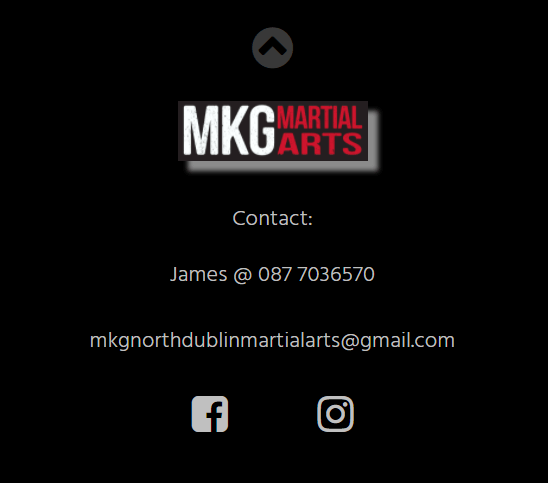

# MKG North Dublin

MKG North Dublin is a martial arts club based in Skerries, Co. Dublin. The MKG North Dublin website is targeted at people who are considering training in martial arts. The website aims to provide all the relevant information about the club and the classes provided and aims to encourage new members to try a class.

Welcome to [MKG North Dublin](https://davecaulfield.github.io/mkg-north-dublin-martial-arts/index.html)

# User Experience (UX)

## User Stories
* As a user I want to be able to navigate through the whole site smoothly.
* As a user I want to understand the purpose of the site upon loading it.
* As a user I want to easily be able to contact MKG North Dublin for more information.
* As a user I want to know more about MKG North Dublin.
* As a user I want to know what classes are available at MKG North Dublin.
* As a user I want to connect with MKG North Dublin on social media.

## Wireframes
The wireframes for MKG North Dublin website were produced using Balsamiq. There are frames for a desktop display and a mobile display. There are some differences between the original wireframes and the deployed site.

[Back to top](#mkg-north-dublin)

## Site Structure
The MKG North Dublin website has four pages. The [home](index.html) page, [about](about.html) page, [classes](classes.html) page and [gallery](gallery.html) page are all accessible from the navigation menu links. There is a [thank you](thankyou.html) page that greets the user after they submit a request for a free class via the free class form.

[Back to top](#mkg-north-dublin)

## Design Choices

### Typography
The fonts used are Lato with a fallback of tahoma for the main heading and hind with a fall back of san-serif for the section headings and body text.

- Lato allows for a less formal and a more welcoming feel to the large bold text used in the main heading on the homepage. 

-  Hind is used for section heading and gives a less formal, more welcoming feel. Hind is also used in the body text and contrast with the section headings. Its clear and easily readable for the user. 

###   Colour scheme

The colour scheme is based on the MKG North Dublin martial arts club colours - black, white, red, yellow.
Black gives a premium feel to the club website. Subtle use of red, white and yellow help to emphasis different sections and features to the user. The body text was changed from white to silver to add more contrast with the section headings and make the text easier to read.

[Back to top](#mkg-north-dublin)

# Features

The MKG North Dublin website is designed to provide clear information and intuitive navigation for the user. The theme is minimlaist but inviting and encouraging for the user.

# Existing Features

## Navigation Menu
   - The navigation menu sits at the top of all pages on the website. It contains inter-active links to all pages guiding the user easily throughout the website.

[Back to top](#mkg-north-dublin)

## The landing page
   - The landing page displays an image map of the world with a club tag line and quote. This combines to let the the user know that MKG Noth Dublin is a martial arts club that is part of a wider global martial arts organisation and conveys a welcoming club ethos to the user.

[Back to top](#mkg-north-dublin)

## Footer
   - The footer contains contact details and links to social media sites.
   - The phone and email details are inter-active allowing the user to click to connect with the club.
   - The social media icons are inter-active and open in a new tab. The club is very active on social media which allows the user to learn more about the club.
   - A scroll to top feature was added using the club logo in the footer. This allows for easier navigation of the site for the user. 

[Back to top](#mkg-north-dublin)

## About page

   - The about pages provides information to the user about the coaches, the club, the different arts taught at the club, and the benefits of martial arts practice.

   ## Our Coaches
   - Our Coaches section provides a photo and background information of the coaches. 
   - The coaches smiling in the photo re-assures the user and helps the user connect with the coaches. It conveys a message of fun.
   - The red, black and white of the instructor photo also connects with the website color scheme and overall theme. 

  [Back to top](#mkg-north-dublin) 

## Our Story 

   - Our Story section provides an image of the club logo with a brief history of the club and its connection with a global martial arts organisation.
   - The red, black and white of the logo provide continutity and flow through the website sections. 

  

  [Back to top](#mkg-north-dublin)  

  ##  Description of arts

   - A description is given of the three main type of martial arts available at the club. This gives the user a clear understanding to the user of what arts the club teaches.
   
   

  [Back to top](#mkg-north-dublin)  
  

## Benefits section
   - A Benefits of Martial Arts section outlines some of the benefits of training martial arts to the user. 
   - The benefits listed are weighted more toward the mental benefits as they may be less well known to the user. It also gives a less intimating feel to the user.
   - An embedded TedX talk eplains in a more detailed and engagingw way what the Filipino martial art Kali is and the cognitive benfits of it. 
   - The TedX content and branding match the website and re-inforces the benefits of Kali. It also promotes the art to the user as it not a widely known martial art. 
   - The video does not play automatically and is controlled by the user.

  [Back to top](#mkg-north-dublin)  

  ## Classes page
   - The Classes page lets the user know that classes are suitable for beginners.
   - Location of the club and classes is provided.
   - An interactive timetable lets the user find out class times.
   - A description of the different class age groups is provided.
   - A form to request a free class is highlighted and has a call to action button.
   - A video demonstrating some training in Jeet Kune Do with a re-assuring quote helps encourage the user to try out a class.

   ## Class Timetable 
   - The class timetable uses a responsive drop down feature that allows it to work well for the user on both mobile and desktop.

   

  [Back to top](#mkg-north-dublin) 

  ## Free Class Form
   - A free class form encourages the user to try a frre class. The form stands out on the page and has a call to action submit button.
   - The form has three input fields - first name, last name, and enail. All fields are required to allow the form to be submitted.

   

  [Back to top](#mkg-north-dublin) 

  ## Jeet Kune Do Video
   - The video content demonstrating some training in Jeet Kune Do and the quote are re-assuring to the user and helps encourage the user to try out a class. 
   - The video does not play automatically and is controlled by the user.

  [Back to top](#mkg-north-dublin) 

  ## Free class - Thank You Page
   - A Thank you page greets the user when they submit the free class form.
   - This is used as there is no post function in the website.
   - The Thank you page explains to the user that their free class is waiting for them but the application form did not go through. It informs the user to email the club to arrange their free class. The thank you messaage is signed off by the head coach.
   - The familar navigation menu and footer are in place on the thank you page.
   - The thank you page feature allows the website to be used as is by MKG North Dublin Ltd without having to wait for a form post function or back end to be added.

   

  [Back to top](#mkg-north-dublin) 

# Technologies Used

  - [HTML](https://html.spec.whatwg.org/) was used to structure the website.
  - [CSS](https://www.w3.org/Style/CSS/Overview.en.html) was used to style the website.
  - [Balsamiq](https://balsamiq.com/wireframes/) was used to create the wireframe designs.
  - [Gitpod](https://www.gitpod.io/#get-started) was used to create and edit the website files.
  - [Github](https://github.com/) was used to host and deploy the website.

   [Back to top](#mkg-north-dublin) 

# Testing

Please see [testing](testing.md) page for details of MKG North Dublin website testing. 

 [Back to top](#mkg-north-dublin) 

 # Deployment
 - The site was deployed to GitHub pages. The steps to deploy are as follows:

 1. In the Github repository select the **Settings** tab.
 2. Select the **pages** tab on the left of screen.
 3. In the **source** section select the branch drop down and set to **main**, then click **save**.

 

 4. Once you select save the page will refresh and a link to the published site will be displayed.

 

Live link to the published site -
[https://davecaulfield.github.io/mkg-north-dublin-martial-arts/](https://davecaulfield.github.io/mkg-north-dublin-martial-arts/)

## To fork the repository on Github

A fork is a copy of a repository. Forking a repository allows you to freely experiment with changes without affecting the original project.

1. In the Github repository select the **fork** button on the top right of screen. This will create a copy of the original repository to your github account.

## To clone the repository

cloning the repository creates a local copy on your computer.

1. In the Github repository select the **code** tab.
2. In the **clone https** section select the clipboard icon.

3. Open **Git Bash** terminaal in your IDE.
4. Go to or create a directory for the cloned repository.
5. Enter command **git clone** and paste the URL copied from GitHub.
6. Press **enter** and the local clone will be created.

 [Back to top](#mkg-north-dublin) 

 # Credits

 ## Content
 - The wireframes were created using [Balsamiq](https://balsamiq.com/wireframes/)
 - The font came from [GoogleFonts](https://fonts.google.com/)
 - The icons came from [Font Awesome](https://fontawesome.com/)
 - The code to structure the timetable came from [Codepen](https://codepen.io/)
 - The idea for the landing page zoom and gallery came from [CI Love Running project](https://codeinstitute.net/ie/)

 ## Media
 - The MKG logos and photos came from [MKG North Dublin](https://www.facebook.com/mkgnorthdublin/)
 - The landing page image came from [Freeimages](https://www.freeimages.com/)
 - The embedded videos came from [YouTube](https://www.youtube.com/)
 - The photos and images were compressed using [Compressor](https://compressor.io/) and [Tinypng](https://tinypng.com/)

 [Back to top](#mkg-north-dublin) 

 # Acknowledgements

 The MKG North Dublin website was built as my Portfolio 1 Project for the Full Stack Software Developer (e-Commerce) Diploma at the [Code Institute](https://codeinstitute.net/ie/). I would like to thank my cohort facilitator [Kasia Bogucka](https://github.com/bezebee), my mentor [Precious Leige](https://www.linkedin.com/in/precious-ijege-908a00168/), the Slack community and all at the Code institute for the help and support provided to me throughout  this project. I would also like to thank James Devine at MKG North Dublin for the support in creating this website. The MKG Dublin website will be deployed as the live site for the club.

 Dave Caulfield 2021

 [Back to top](#mkg-north-dublin) 