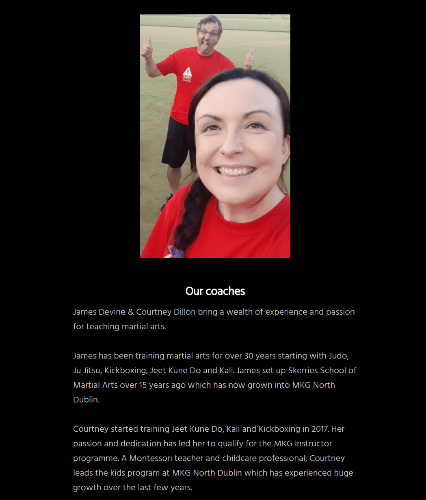

# MKG North Dublin

MKG North Dublin is a martial arts club based in Skerries, Co. Dublin. The MKG North Dublin website is targeted at people who are considering training in martial arts. The website aims to provide all the relevant information about the club and the classes provided and aims to encourage new members to try a class.

Welcome to [MKG North Dublin](https://davecaulfield.github.io/mkg-north-dublin-martial-arts/index.html)

# User Experience (UX)

## User Stories
* As a user I want to be able to navigate through the whole site smoothly.
* As a user I want to understand the purpose of the site upon loading it.
* As a user I want to easily be able to contact MKG North Dublin for more information.
* As a user I want to know more about MKG North Dublin.
* As a user I want to know what classes are available at MKG North Dublin.
* As a user I want to connect with MKG North Dublin on social media.

## Wireframes
The wireframes for MKG North Dublin website were produced using Balsamiq. There are frames for a desktop display and a mobile display. There are some differences between the original wireframes and the deployed site.

[Back to top](#mkg-north-dublin)

## Site Structure
The MKG North Dublin website has four pages. The [home](index.html) page, [about](about.html) page, [classes](classes.html) page and [gallery](gallery.html) page are all accessible from the navigation menu links. There is a [thank you](thankyou.html) page that greets the user after they submit a request for a free class via the free class form.

[Back to top](#mkg-north-dublin)

## Design Choices

### Typography
The fonts used are Lato with a fallback of tahoma for the main heading and hind with a fall back of san-serif for the section headings and body text.

- Lato allows for a less formal and a more welcoming feel to the large bold text used in the main heading on the homepage. 

-  Hind is used for section heading and gives a less formal, more welcoming feel. Hind is also used in the body text and contrast with the section headings. Its clear and easily readable for the user. 

###   Colour scheme

The colour scheme is based on the MKG North Dublin martial arts club colours - black, white, red, yellow.
Black gives a premium feel to the club website. Subtle use of white, red and yellow help to emphasis different parts of the website and its features. The body text was changed from white to silver to add more contrast with the section headings and make the text easier to read.

[Back to top](#mkg-north-dublin)

# Features

The MKG North Dublin website is designed to provide clear information and intuitive navigation for the user. The theme is minimlaist but inviting and encouraging for the user.

# Existing Features

## Navigation Menu
   - The navigation menu sits at the top of all pages on the website. It contains responsive links to all pages guiding the user easily throughout the website.

[Back to top](#mkg-north-dublin)

## The landing page
   - The landing page displays an image map of the world with a club tag line and quote. This combines to let the the user know that MKG Noth Dublin is a martial arts club that is part of a wider global martial arts organisation and conveys a welcoming club ethos.

[Back to top](#mkg-north-dublin)

## Footer
   - The footer contains contact details and links to social media sites.
   - The phone and email details are fully responsive allowing the user to click to connect with the club.
   - The social media icons are fully responsive and open in a new tab. The club is very active on social media which allows the user to learn more about the club.
   - A scroll to top feature was added using the club logo in the footer. This allows for easier navigation of the site. 

[Back to top](#mkg-north-dublin)

## About page

   - The about pages provides information to the user about the coaches, the club, the different arts taught at the club, and the benefits of martial arts practice.

   ## Our Coaches
   - Our Coaches section provides a photo and background information of the coaches. 
   - The coaches smiling in the photo re-assures the user and helps the user connect with the coaches. It conveys a message of fun.
   - The red, black and white of the instructor photo also connects with the website color scheme and overall theme. 

  [Back to top](#mkg-north-dublin) 

## Our Story 

   - Our Story section provides an image of the club logo with a brief history of the club and its connection with a global martial arts organisation.
   - The red, black and white of the logo provide continutity and flow through the website sections. 

  

  [Back to top](#mkg-north-dublin)  

  ##  Description of arts

   - A description is given of the three main type of martial arts available at the club. This gives the user a clear understanding to the user of what arts the club teaches.
   
   

  [Back to top](#mkg-north-dublin)  
  

