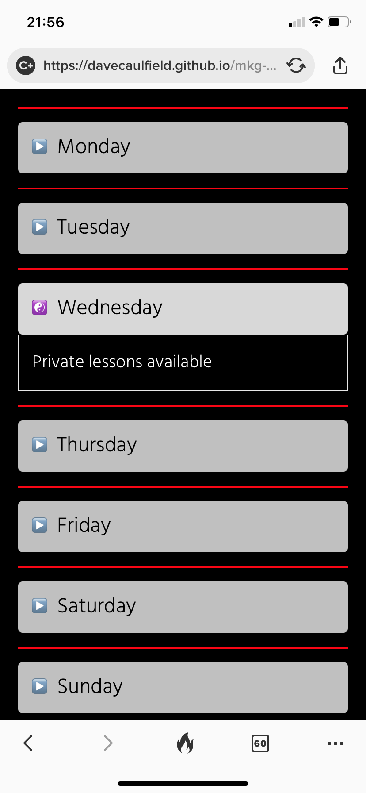
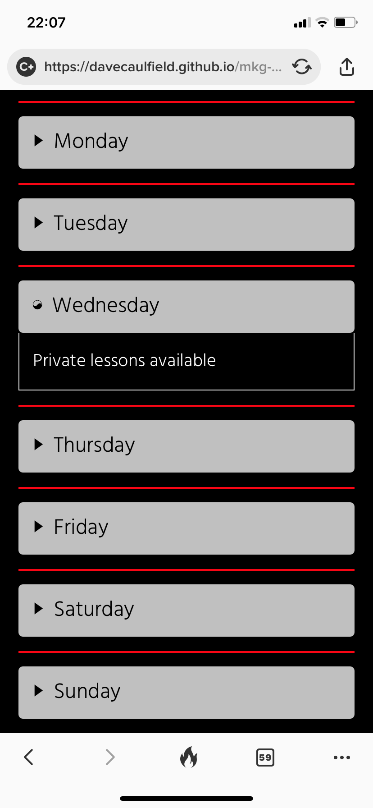
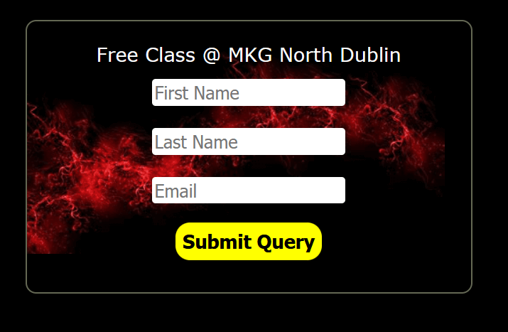
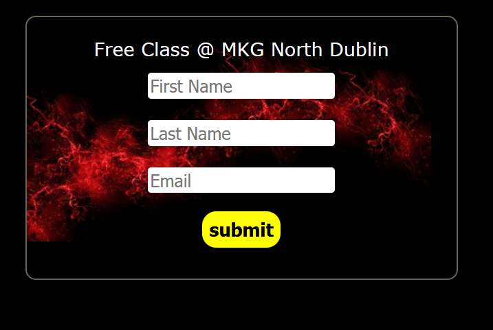

# Testing

## Code Vaildation
The code for MKG North Dublin website has been tested using [W3C HTML Validator](https://validator.w3.org/) and [W3C CSS Validator](https://jigsaw.w3.org/css-validator/) . There were some minor fixes required after testing, a space in the telephome number between country code and mobile number. This was corrected and all html and CSS files passed validation checks.

HTML vaildator results:

- Home page 

 - About page

 

 - Classes page

 

 - Gallery page

 

 - Thank you page

 

 CSS Vaildator results:

 

 ## Responsiveness Testing
- Responsivness was tested using [Google Chrome DevTools](https://developer.chrome.com/docs/devtools/) and [Responsive design checker](https://responsivedesignchecker.com/). 
    - Media queries were added to ensure responsiveness for smalll screens. 
    - After adding media queries the site was found to be responsive for small, medium and large screens.

## Browser Compatability

- The site was tested Google Chrome, Safari, Microsoft Edge and Mozilla Firefox web browsers. 
- issues were detected on Safari ios and Mozilla Firefox - see Known bugs section for details. 
- After issues were fixed the site was found to work on all browsers. 

# Known Bugs

## Resolved
- During browser testing, Safari ios mobile did not render the icons in the timetable correctly.

- A fix was found on Stackoverflow. A variation selector of \fe0e was added with the css entity to specify it as text not as (default) emoji. Implementing the variation selector resolved the issue.

- During browser testing, Mozilla Firefox displayed "Submit Query" on the free claas submit button. All other browsers displayed "Submit".

- A value had been omitted for the submit input. When value="submit" was added the submit button feature rendered correctly.

## unresolved
- The free class form displays as a valid form for the user but there is no post function. This is outside the scope of the project and will be re-visted in further releases for MKG North Dublin.

# Additional Testing

## Lighthouse
- [lighthouse](https://developers.google.com/web/tools/lighthouse) was used to test the MKG North Dublin site for performance, accessibility, best bractices and SEO.

- Performance - How fast it takes a webpage to load.
- Accessibility - How accessible a website is (users might need a screen reader).
- Best Practices - How the site conforms to coding best practices.
- SEO - Search engine optimisation. How optimised the site is for search engine results.

## Peer review
The site was peer reviewed by the Code Institute slack community. This highlighted that the scroll to top feature was not intuitive to the user. The feature was updated to be more intuitive to the user.

Back to [README.md](README.md)