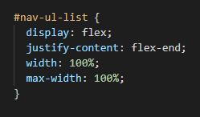
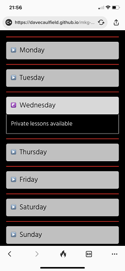
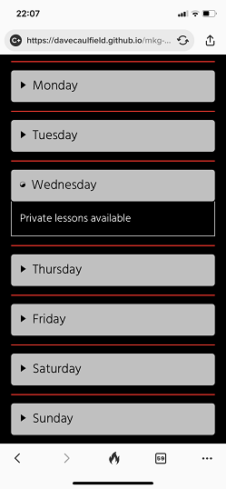

# Testing
Testing ensured that MKG North Dublin website appearance, responsiveness and funcionality worked as expected. It ensures that the user experience is enjoyable whilst using mobile, tablet or desktop device and their browser of choice.

## Code Vaildation
- The code for MKG North Dublin website has been tested using [W3C HTML Validator](https://validator.w3.org/) and [W3C CSS Validator](https://jigsaw.w3.org/css-validator/).
-  There were some minor fixes required after validator testing including a space left in the telephone number between country code and mobile number. 
- This was corrected and all HTML and CSS files passed validation checks.

HTML vaildator results:

- Home page 

 - About page

 

 - Classes page

 

 - Gallery page

 

 - Thank you page

 

 CSS Vaildator results:

 

 Back to [README.md](README.md)

 ## Responsiveness Testing
- Responsivness was tested using [Google Chrome DevTools](https://developer.chrome.com/docs/devtools/) and [Responsive design checker](https://responsivedesignchecker.com/). 
    - Devices tested using these tools were Moto G4, Galaxy S5, iPhone5, iPhone6/7 iPad, iPad pro,Display <1200px, Display >1200px
    - Media queries were added to ensure responsiveness for smalll screens. 
    - Max width was set to ensure site displayed ok on extra large screen.
    - After adding media queries the site was found to be responsive for small, medium and large screens.

 
 

 Back to [README.md](README.md)
    

## Physical device testing
  - Physical device testing highligted discrepencies in the test results compared to dev tools. 
  - Differences were found between Dev Tools iOS devices and physical iOS devices - see known bugs section.
  - Physical devices used in testing were iPhone6, iPhone11, iPad, Laptop and extra large monitor.
  - After issues were fixed the rendering, responsiveness and all functionality of the site was found to work as expected.
  

## Browser Compatability
- The site was tested using Google Chrome, Microsoft Edge, Mozilla Firefox and Safari web browsers. 
- Testing checked for:
    - Rendering/Appearance
    - Responsiveness
    - Functionality 
- Issues were detected with Safari ios and Mozilla Firefox - see Known bugs section for details. 
- After issues were fixed the rendering, responsiveness and all functionality was found to work as expected.

Back to [README.md](README.md)

# Known Bugs

## Resolved

### nav link position
- Physical device testing with ios devices, iphone6, iPhone11 and iPad showed navigation links to display on the left hand side of the screen instead of the right side.    
    - Windows laptop using Chrome, Edge and Firefox all displayed the links correctly on the right hand side of the screen. 
    - Dev Tools also displayed the links on the right when testing ios devices. 
- Trouble shooting was carried out trying safari ios specific prefixes and using [CSS auto prefixer](https://autoprefixer.github.io/). 
- The issue was eventually found, with assistance from the Slack community, to be caused by incorrectly using "end" instead of "flex-end" for the justify-content line of code being applied to position the navigations un-ordered list. 
- This fix resolved the issue for all physical ios devices tested.
- Note - the final style choice centred the nav links for extra small screens for a better user experience. All other screen sizes correctly display the nav links to the right.

### overflow
- Physical device testing on mobile phones showed that some pages overflowed to the left and right when scrolling. 
- This was debugged using chrome extension [unicorn revealer](https://chrome.google.com/webstore/detail/unicorn-revealer/lmlkphhdlngaicolpmaakfmhplagoaln?hl=en-GB) and found to be caused by the width of the nav ul extending outside the width of the view port. 
- Setting the width and max-width of the navigation un-ordered list fixed the issue for portrait display.
- Further width adjustment to the body paragraphs fixed the issue for landscape display.

### icons
- During physical device/browser testing, Safari ios mobile did not render the icons in the timetable correctly. 
    - All other browsers displayed the icons correctly.

- A fix was found on Stackoverflow. 
- A variation selector of \fe0e was added with the css entity to specify it as text not as (default) emoji. 
- Implementing the variation selector resolved the issue.

### submit button
- During browser testing, Mozilla Firefox displayed "Submit Query" on the free class submit button. 
    - All other browsers displayed "Submit".

- A value attribute was found to have been omitted for the submit input. 
- When value="submit" was added the submit button feature rendered correctly.

Back to [README.md](README.md)

## unresolved
- The free class form displays as a valid form for the user but there is no post function. 
    - This is outside the scope of the project and will be re-visted in future releases for MKG North Dublin.

- While the scroll to top feature works on all browsers and devices the smooth scroll feature doesn't work for safari ios mobile. 
    - Smooth scroll works as expected for Chrome, Edge and Firfox browsers.
    - To fix this a JS polyfill is required which is outside the scope of the project. 
    - It will be fixed in a future release of the website.

    Back to [README.md](README.md)

# Additional Testing

## Lighthouse
- [lighthouse](https://developers.google.com/web/tools/lighthouse) was used to test the MKG North Dublin site for performance, accessibility, best bractices and SEO.

    - Performance - How fast it takes a webpage to load.
    - Accessibility - How accessible a website is (users might need a screen reader).
    - Best Practices - How the site conforms to coding best practices.
    - SEO - Search engine optimisation. How optimised the site is for search engine results.

Back to [README.md](README.md)

## Peer review
- The site was peer reviewed by the Code Institute slack community. 
- This highlighted that the scroll to top feature was not intuitive to the user. 
- The feature originally used the MKG text logo as the back to top feature button.
- This was updated to use an interactive up arrow icon which is much more intuitive to the user.

Back to [README.md](README.md)